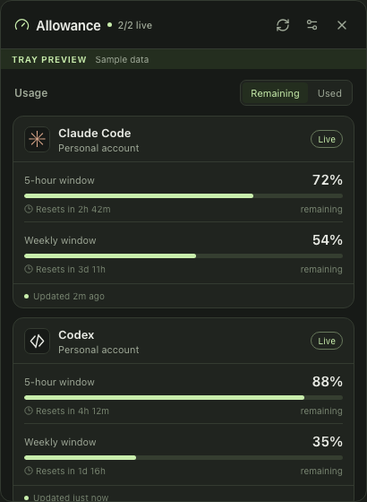
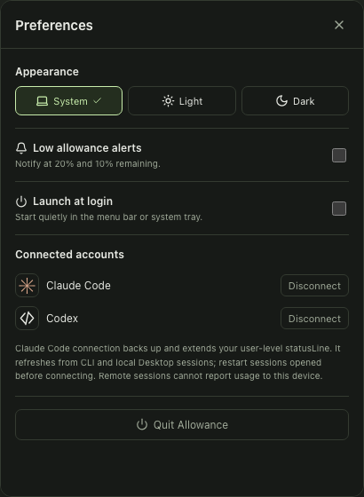

# Allowance

Allowance is an open-source macOS and Windows tray widget for viewing Claude Code and Codex subscription allowance. It uses the provider apps and CLIs already installed and authenticated on your computer and shows current usage in a compact tray popover.

The Apple Silicon Mac build is tested, and a Windows x64 NSIS installer is cross-built and structurally verified. Native Windows runtime testing and the Intel Mac build still need release validation; see [VALIDATION.md](VALIDATION.md).

## Download

| Platform | Installer |
| --- | --- |
| macOS 12+ on Apple Silicon | [Download the macOS DMG](installers/Allowance_macOS-arm64.dmg) |
| Windows 10/11 x64 | [Download the Windows installer](installers/Allowance_windows-x64-setup.exe) |

These installers are unsigned. macOS Gatekeeper and Windows SmartScreen may therefore show a warning. Review [SETUP.md](SETUP.md) for installation instructions and [SHA256SUMS.txt](installers/SHA256SUMS.txt) to verify a download.

## Screenshots

| Usage overview | Preferences |
| --- | --- |
|  |  |

## Features

- Separate remaining or used bars for each provider usage window
- Reset countdowns, stale-state handling, account-change protection, and manual refresh
- Optional alerts at 20% and 10%, deduplicated per reset period
- Tray-anchored usage popover, themes, and launch at login
- No cloud service, telemetry, stored credentials, prompts, or conversation content

## Install and connect

Follow [SETUP.md](SETUP.md) for macOS, Windows, Codex, and Claude Code instructions. Claude connection is opt-in because it changes the user-level Claude `statusLine` setting. Allowance backs up that setting, keeps existing status-line output, and restores it on disconnect when it still owns the value.

## How provider data works

Codex is read through a local `codex app-server` using `account/read` and `account/rateLimits/read`. Allowance refreshes it every two minutes and when the panel opens. It never starts an AI conversation.

Allowance prefers Claude Desktop's local plan-usage history and its cached usage response, which the official Desktop app refreshes during normal use. The history supplies percentages; the cached response supplies matching reset timestamps. Allowance checks these local files every 30 seconds and on manual refresh, extracts only the displayed usage fields, and does not inspect conversations or credentials. The history is typically sampled every 12–15 minutes, so the tray shows the newest value Claude Desktop has fetched rather than a second-by-second estimate. Claude Code's documented status-line data remains the fallback for CLI sessions. Remote Desktop sessions cannot update files on this device.

Missing values display as unavailable. Direct readings become stale after ten minutes; Claude Desktop cache readings allow twenty minutes to match its normal sampling interval. Once a reported reset passes, the app waits for a fresh provider observation rather than assuming the quota refilled.

## Build and test

Install Node.js 24 LTS, Rust stable, and the [Tauri platform prerequisites](https://v2.tauri.app/start/prerequisites/).

```sh
npm ci
npm test
cargo test --manifest-path src-tauri/Cargo.toml
cargo clippy --manifest-path src-tauri/Cargo.toml -- -D warnings
npm run build
npm run package -- --bundles app,dmg  # macOS
npm run package -- --bundles nsis     # Windows
```

Run `npm run desktop` for the native development app. `npm run dev` opens a browser preview that is clearly labeled as sample data. A read-only live Codex check is available with:

```sh
cargo test --manifest-path src-tauri/Cargo.toml live_codex_read_only -- --ignored --nocapture
```

The workflow in `.github/workflows/build.yml` builds unsigned test packages on native Apple Silicon, Intel Mac, and Windows runners. Publicly trusted installers require platform signing; follow [RELEASING.md](RELEASING.md).

## Local data

On macOS, settings and the Claude Code bridge state are stored under `~/Library/Application Support/app.allowance.widget/`. On Windows, they are in the corresponding per-user application-data directory. The connected account label can appear in the popover and the latest local Claude snapshot; provider credentials remain in the provider tools.

Before deleting the app data directory, disconnect Claude Code from Preferences so Allowance can restore the backed-up status line. Connected installations atomically switch to a versioned current helper and update their supported refresh setting after an Allowance upgrade.

Read [PRIVACY.md](PRIVACY.md), [SECURITY.md](SECURITY.md), and [CONTRIBUTING.md](CONTRIBUTING.md) before distributing or contributing. Allowance is independent software and is not affiliated with, endorsed by, or sponsored by Anthropic or OpenAI. Claude, Claude Code, Codex, and ChatGPT are trademarks of their respective owners.

## License

MIT. See [LICENSE](LICENSE).
